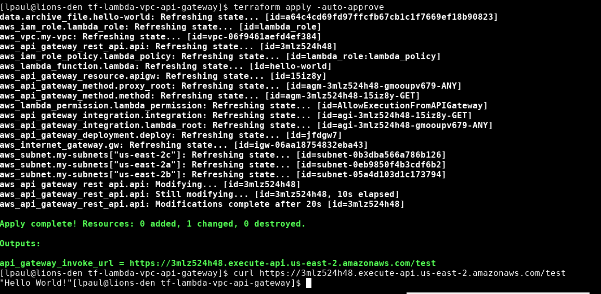

## Task ##

Terraform config for launching the following:

I.  A lambda on vpc with a simple helloworld.js - inline zip file for code, no s3 dependencies.

II. API gateway frontending the lambda

And then, add couple testcases in the scripting language of your choice to verify the resources from step I and II.

## Sample Run ##

